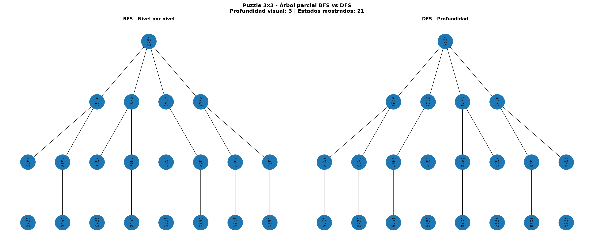
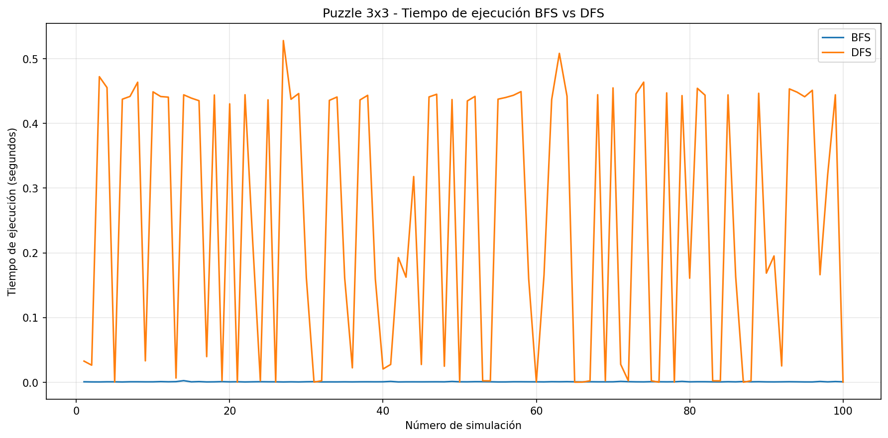
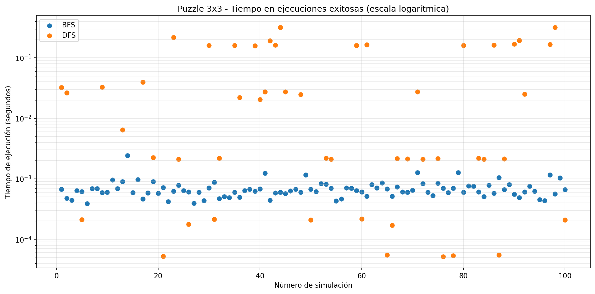
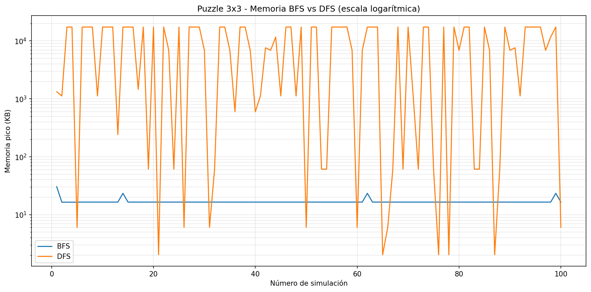
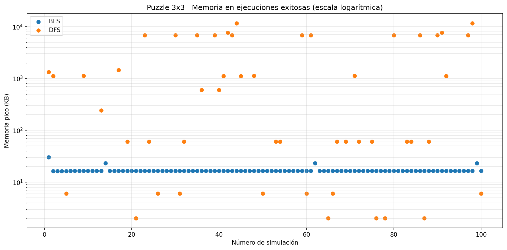
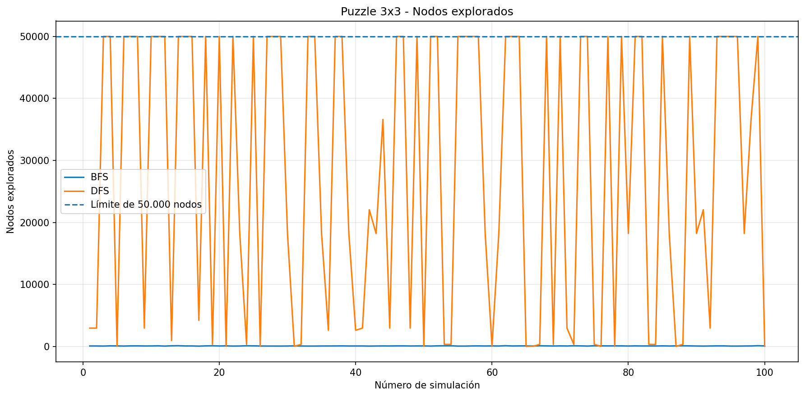
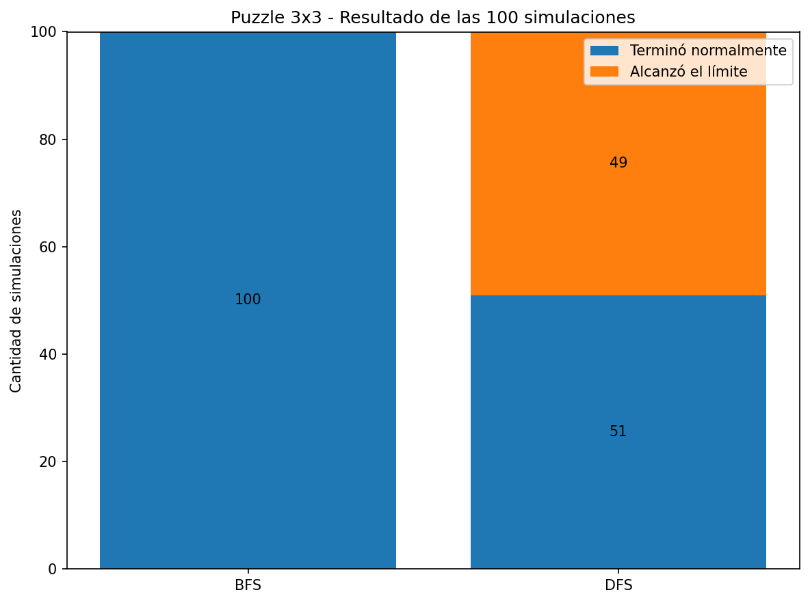

# Informe Final
## Análisis de Desempeño de BFS vs DFS

## Integrantes

- Lina Castañeda
- Jorge García
- Brayan Hernandez

## Repositorio

https://github.com/linacastaneda/Desempe-o-BFS-vs-DFS

---

## 1. Introducción

La búsqueda en anchura (**BFS**) y la búsqueda en profundidad (**DFS**) son dos estrategias clásicas para recorrer espacios de estados. Aunque ambas permiten explorar soluciones en problemas combinatorios, su comportamiento puede variar de manera importante según la estructura del problema, la profundidad de las soluciones y la cantidad de estados que deben mantenerse en memoria.

En este proyecto se compara experimentalmente el desempeño de BFS y DFS en tres problemas:

- Puzzle 3x3.
- N-Reinas.
- Mochila 0/1.

El análisis se concentra principalmente en el tiempo de ejecución y el consumo de memoria. La cantidad de nodos explorados y, cuando aplica, la profundidad o longitud de la solución se utilizan como métricas auxiliares para explicar el comportamiento observado.

---

## 2. Metodología General

Las implementaciones fueron desarrolladas en Python. Para la medición experimental se utilizaron principalmente:

- `time.perf_counter()` para medir tiempo de ejecución.
- `tracemalloc` para registrar memoria pico durante la ejecución.
- Contadores explícitos de nodos explorados como métrica auxiliar.

Dentro de cada problema, BFS y DFS se ejecutan bajo las mismas condiciones de entrada, de modo que la comparación entre ambos sea directa.

La complejidad teórica se interpreta de acuerdo con la estructura de cada espacio de búsqueda. Por esta razón, los tres problemas no presentan necesariamente la misma expresión asintótica aunque utilicen los mismos algoritmos de recorrido.

---

## 3. Análisis del Problema de N-Reinas

### 3.1 Descripción del problema

El problema de N-Reinas consiste en ubicar N reinas sobre un tablero de tamaño N × N de manera que ninguna pueda atacar a otra. Esto implica evitar coincidencias en filas, columnas y diagonales.

En la implementación utilizada, el tablero se representa como una lista en la que el índice corresponde a la columna y el valor almacenado corresponde a la fila en la que se ubica la reina.

El objetivo de BFS y DFS es encontrar la primera solución completa válida.

### 3.2 Configuración experimental

Se evaluaron tamaños entre N=4 y N=13. La cantidad de repeticiones disminuye en los valores más grandes debido al aumento significativo del costo de BFS.

| N | Repeticiones por algoritmo |
|---:|---:|
| 4 a 10 | 100 |
| 11 | 50 |
| 12 | 20 |
| 13 | 10 |

Las métricas principales fueron tiempo de ejecución y memoria pico, mientras que los nodos explorados se utilizaron como apoyo para interpretar las diferencias observadas.

### 3.3 Complejidad

El espacio de búsqueda de N-Reinas tiene un comportamiento combinatorio asociado a las diferentes posiciones posibles de las reinas. En el peor caso, el crecimiento se aproxima a una estructura factorial.

| Aspecto | BFS | DFS |
|---------|-----|-----|
| **Tiempo peor caso** | O(N!) | O(N!) |
| **Espacio de frontera** | O(N!) | O(N) |
| **Orden de recorrido** | Nivel por nivel | Rama por rama |
| **Criterio de terminación** | Primera solución completa | Primera solución completa |

DFS resulta espacialmente favorable porque profundiza una rama y mantiene principalmente el camino actual y las alternativas pendientes. BFS, en cambio, puede conservar simultáneamente una gran cantidad de estados pertenecientes al mismo nivel.

### 3.4 Árbol de búsqueda

Para visualizar el comportamiento de ambos algoritmos se utiliza N=4.


El árbol permite observar que BFS recorre los estados por niveles, mientras DFS avanza en profundidad hasta encontrar una solución o necesitar retroceder.

Esta diferencia de orden es relevante porque en N-Reinas no se requiere encontrar una solución con profundidad mínima: todas las soluciones completas tienen N reinas. Por tanto, recorrer niveles completos antes de profundizar no aporta una ventaja práctica para este criterio de terminación.

### 3.5 Tiempo de ejecución


Los resultados muestran una diferencia creciente entre BFS y DFS a medida que aumenta N. Para tamaños pequeños ambos algoritmos pueden completar la búsqueda rápidamente, pero BFS incrementa su costo de forma mucho más marcada en las instancias grandes.

Para N=13, los resultados guardados muestran un tiempo promedio aproximado de **112 segundos para BFS**, mientras DFS se mantiene alrededor de **0,0012 segundos**.

Este comportamiento se explica por la forma en que BFS debe expandir y conservar grandes niveles del espacio de búsqueda antes de llegar a estados completos, mientras DFS puede alcanzar rápidamente una solución profundizando por una secuencia válida de decisiones.

### 3.6 Consumo de memoria


La diferencia de memoria es todavía más marcada. BFS conserva una frontera amplia y el número de estados almacenados crece rápidamente con N.

Para N=13, BFS alcanza aproximadamente **234.770 KB**, mientras DFS utiliza alrededor de **1,7 KB** en los resultados registrados.

Esto confirma que la principal desventaja práctica de BFS en N-Reinas es el tamaño de la frontera que debe mantener simultáneamente.

### 3.7 Nodos explorados


La cantidad de nodos explorados muestra que BFS debe procesar una fracción mucho mayor del espacio de búsqueda antes de alcanzar una solución completa.

DFS, al profundizar en una rama válida, puede encontrar la primera solución con una cantidad considerablemente menor de estados procesados.

Por tanto, en este problema la diferencia de tiempo y memoria no se debe únicamente a las estructuras de datos utilizadas, sino también a que el criterio de terminación favorece el orden de recorrido de DFS.

### 3.8 Distribución del tiempo


La distribución temporal permite observar la variabilidad de las mediciones. En los valores mayores de N, BFS presenta ejecuciones mucho más costosas y una dispersión mayor que DFS.

DFS se mantiene relativamente estable debido a que, bajo el orden de generación utilizado, suele alcanzar una primera solución completa después de explorar una cantidad reducida de estados.

### 3.9 Conclusión particular de N-Reinas

Los resultados experimentales muestran que **DFS es considerablemente más eficiente que BFS para encontrar la primera solución del problema de N-Reinas** en esta implementación.

La ventaja de DFS se manifiesta en las tres métricas analizadas: explora menos nodos, requiere menos tiempo y utiliza mucha menos memoria. BFS no obtiene un beneficio práctico por recorrer el espacio nivel por nivel, ya que el problema no exige encontrar una solución de menor profundidad.

---

## 4. Análisis del Problema de Mochila 0/1

### 4.1 Descripción del problema

El problema de Mochila 0/1 consiste en seleccionar un subconjunto de objetos con el propósito de maximizar su valor total sin superar una capacidad máxima de peso.

Cada objeto tiene dos posibilidades:

- No tomarlo.
- Tomarlo, siempre que el peso acumulado no supere la capacidad.

El estado utilizado en la implementación es:

```text
(indice, peso_actual, valor_actual, seleccionados)
```

Cada nivel del árbol representa la decisión asociada a un objeto.

### 4.2 Configuración experimental

Se realizaron 100 instancias aleatorias distribuidas en cinco tamaños:

| Cantidad de objetos | Simulaciones |
|---:|---:|
| 5 | 20 |
| 8 | 20 |
| 10 | 20 |
| 12 | 20 |
| 15 | 20 |

Para cada instancia:

- Los pesos se generan entre 1 y 15.
- Los valores se generan entre 1 y 30.
- La capacidad corresponde aproximadamente al 40 % del peso total.
- Se utiliza `random.seed(42)` para reproducibilidad.
- La misma instancia se ejecuta con BFS y DFS.

En total se realizan 200 ejecuciones: 100 con BFS y 100 con DFS.

### 4.3 Complejidad

En Mochila 0/1, cada objeto puede generar hasta dos decisiones, por lo que el árbol puede crecer exponencialmente.

| Aspecto | BFS | DFS |
|---------|-----|-----|
| **Tiempo peor caso** | O(2^N) | O(2^N) |
| **Espacio de frontera** | O(2^N) | O(N) |
| **Profundidad máxima** | O(N) | O(N) |
| **Orden de recorrido** | Nivel por nivel | Rama por rama |

Ambos algoritmos realizan una búsqueda exhaustiva sobre el mismo árbol factible y, por tanto, presentan la misma complejidad temporal **O(2^N)** en el peor caso.

Estas expresiones espaciales consideran cada estado como una unidad. En la implementación concreta, cada estado almacena además la lista de objetos seleccionados, por lo que el consumo real de memoria incluye el costo adicional de almacenar y copiar dicha lista.

### 4.4 Árbol de búsqueda

Para la visualización se utiliza una instancia pequeña con:

- Pesos: `[2, 3, 4, 5]`.
- Valores: `[3, 4, 5, 8]`.
- Capacidad: `8`.

La solución óptima tiene valor **12** y ambos algoritmos exploran **24 nodos**.


La figura presenta el mismo árbol de decisiones para BFS y DFS, pero con diferente orden de visita. Esto permite comprobar que la diferencia de desempeño no proviene de que un algoritmo explore menos estados en esta implementación.

### 4.5 Resultados cuantitativos

| Objetos | BFS Tiempo | DFS Tiempo | BFS Memoria | DFS Memoria | Nodos BFS | Nodos DFS |
|--------:|-----------:|-----------:|------------:|------------:|----------:|----------:|
| 5 | 0.00002971 s | 0.00002710 s | 1.3758 KB | 0.1141 KB | 33.30 | 33.30 |
| 8 | 0.00017801 s | 0.00016852 s | 4.0250 KB | 0.2367 KB | 214.25 | 214.25 |
| 10 | 0.00110635 s | 0.00089131 s | 24.3918 KB | 0.3352 KB | 827.70 | 827.70 |
| 12 | 0.00490357 s | 0.00406395 s | 108.3906 KB | 0.4445 KB | 3071.30 | 3071.30 |
| 15 | 0.04147082 s | 0.02388505 s | 1289.9215 KB | 0.6406 KB | 22012.05 | 22012.05 |

Los datos muestran que BFS y DFS exploran exactamente la misma cantidad promedio de nodos para cada tamaño.

Por tanto, las diferencias de tiempo y memoria observadas se relacionan principalmente con la forma en que cada estrategia administra la frontera de búsqueda.

### 4.6 Tiempo de ejecución


En los tamaños pequeños la diferencia temporal entre BFS y DFS es reducida. Esto es esperable porque las ejecuciones duran fracciones muy pequeñas de segundo y el costo fijo de las operaciones puede influir en las mediciones.

A medida que aumenta la cantidad de objetos, la separación se vuelve más clara. Con 15 objetos, BFS tarda aproximadamente **0,04147 s**, mientras DFS tarda aproximadamente **0,02389 s**, lo que representa cerca de **73,63 % más tiempo para BFS**.

Como ambos algoritmos procesan los mismos estados, la diferencia se asocia principalmente al manejo de sus estructuras de frontera.

### 4.7 Consumo de memoria


La memoria constituye la diferencia más importante en Mochila 0/1.

BFS utiliza una cola FIFO y conserva numerosos estados de un mismo nivel antes de avanzar. Esto provoca que el tamaño de la frontera aumente rápidamente con el número de objetos.

DFS utiliza una pila LIFO y profundiza una rama antes de continuar con las demás alternativas. Por esta razón mantiene simultáneamente una cantidad mucho menor de estados pendientes.

Con 15 objetos, BFS utiliza aproximadamente **1289,92 KB**, mientras DFS utiliza aproximadamente **0,64 KB**. En términos relativos, BFS consume alrededor de **2014 veces** la memoria promedio de DFS.

### 4.8 Comportamiento a lo largo de las simulaciones


La evolución de los tiempos por simulación evidencia el incremento del costo computacional conforme se pasa a instancias con mayor cantidad de objetos.


La gráfica de memoria confirma que el crecimiento de BFS es mucho más pronunciado que el de DFS. La diferencia se hace especialmente visible en las instancias correspondientes a 12 y 15 objetos.

### 4.9 Conclusión particular de Mochila 0/1

En Mochila 0/1, BFS y DFS encuentran el mismo valor óptimo y exploran la misma cantidad de nodos porque ambos realizan una búsqueda exhaustiva sobre el mismo árbol.

Sin embargo, DFS presenta una ventaja clara en consumo de memoria y también un mejor desempeño temporal en las instancias más grandes.

La principal causa no es una reducción del espacio explorado, sino la forma en que cada algoritmo conserva los estados pendientes. BFS mantiene una frontera amplia, mientras DFS mantiene una frontera mucho más pequeña.

---

## 5. Análisis del Problema de Puzzle 3x3

### 5.1 Descripción

El Puzzle 3x3 consiste en organizar las fichas del 1 al 8 y un espacio vacío (`0`) hasta alcanzar una configuración objetivo.

En este experimento se compararon BFS y DFS utilizando las mismas configuraciones iniciales.

Las métricas analizadas fueron:

- Tiempo de ejecución.
- Memoria utilizada.
- Nodos explorados.
- Movimientos realizados.
- Profundidad de la solución.
- Ejecuciones que alcanzaron el límite experimental.

### 5.2 Configuración experimental

Se realizaron 100 simulaciones para cada algoritmo.

Los estados iniciales se generaron a partir del estado objetivo mediante **6 movimientos válidos aleatorios**, evitando la reversión inmediata del último movimiento. Este procedimiento garantiza que las instancias generadas sean solucionables, pero no implica necesariamente que la distancia óptima a la solución sea exactamente de 6 movimientos.

Se estableció un límite experimental de **50.000 nodos por ejecución**. BFS no alcanzó este límite en ninguna simulación, mientras que DFS lo alcanzó en 49 de las 100 ejecuciones.

### 5.3 Complejidad y comportamiento

BFS explora el espacio de búsqueda nivel por nivel, mientras que DFS explora una rama en profundidad antes de regresar para continuar con otras alternativas.

En el Puzzle 3x3 esta diferencia es importante porque las instancias fueron generadas cerca del estado objetivo. BFS puede encontrar rápidamente soluciones de poca profundidad al explorar los niveles de forma sistemática.

DFS, en cambio, depende mucho más del orden en que se generan los movimientos y puede internarse en rutas largas antes de alcanzar la meta.

Además, cuando todos los movimientos tienen el mismo costo, BFS garantiza encontrar una solución de profundidad mínima, mientras DFS no proporciona esta garantía.

### 5.4 Árbol parcial de búsqueda

Para visualizar la diferencia entre BFS y DFS se utiliza una representación parcial común del espacio de estados del Puzzle 3x3.



La visualización muestra el orden de visita de ambos algoritmos sobre el mismo conjunto de estados. BFS recorre los nodos por niveles, mientras DFS profundiza una rama antes de regresar a explorar las demás alternativas.

Este árbol se utiliza con fines comparativos y pedagógicos. No representa la totalidad del espacio de estados ni todos los nodos que pueden recorrerse durante una simulación completa.

### 5.5 Resultados

Los resultados de las ejecuciones que terminaron normalmente fueron:

| Algoritmo | Ejecuciones exitosas | Tiempo promedio (s) | Memoria promedio (KB) | Nodos promedio |
|---|---:|---:|---:|---:|
| BFS | 100 | 0.000690 | 16.82 | 80.25 |
| DFS | 51 | 0.063014 | 2492.67 | 6979.39 |

Las otras 49 ejecuciones de DFS alcanzaron el límite de 50.000 nodos y se identifican por separado.

### 5.6 Tiempo de ejecución



La gráfica global muestra una diferencia muy marcada entre ambos algoritmos. BFS mantuvo tiempos reducidos, mientras DFS presentó ejecuciones mucho más costosas y una parte de ellas llegó al límite experimental.

Para interpretar de forma justa las búsquedas que sí finalizaron, se utiliza también la gráfica de ejecuciones exitosas:



Entre las ejecuciones exitosas, BFS tuvo un tiempo promedio de aproximadamente **0,00069 segundos**, mientras DFS alcanzó aproximadamente **0,063 segundos**.

### 5.7 Consumo de memoria



En el conjunto global, DFS presentó un consumo de memoria considerablemente mayor. Este comportamiento está relacionado con la gran cantidad de estados que llega a explorar y con las estructuras de estados visitados y padres utilizadas por la implementación.

Para las ejecuciones que terminaron normalmente:



BFS utilizó aproximadamente **16,82 KB** en promedio, mientras DFS utilizó aproximadamente **2492,67 KB**.

Aunque DFS suele asociarse teóricamente con una frontera menor, los resultados experimentales dependen de la implementación completa. En este caso, DFS recorrió porciones mucho mayores del espacio de estados y mantuvo estructuras de visitados y padres, lo que produjo un consumo empírico superior.

### 5.8 Nodos explorados



BFS exploró aproximadamente **80,25 nodos en promedio**, mientras DFS exploró aproximadamente **6979,39 nodos** considerando únicamente las ejecuciones exitosas.

La diferencia muestra que BFS encontró las soluciones de estas instancias recorriendo una cantidad mucho menor de estados.

### 5.9 Ejecuciones que alcanzaron el límite

| Algoritmo | Total | Exitosas | Límite alcanzado | Porcentaje |
|---|---:|---:|---:|---:|
| BFS | 100 | 100 | 0 | 0% |
| DFS | 100 | 51 | 49 | 49% |



BFS completó las 100 simulaciones sin alcanzar el límite experimental. DFS completó 51 ejecuciones y alcanzó el límite de 50.000 nodos en 49 ejecuciones.

Este resultado evidencia una mayor variabilidad de DFS en las instancias utilizadas.

### 5.10 Conclusión del Puzzle 3x3

Para las instancias utilizadas en este experimento, **BFS presentó el mejor desempeño general**.

BFS fue más rápido, exploró menos nodos, utilizó menos memoria en las mediciones registradas y completó el 100 % de las simulaciones.

DFS presentó un comportamiento mucho más variable y alcanzó el límite experimental en el 49 % de las ejecuciones. La diferencia se relaciona principalmente con que las instancias se generaron cerca de la meta y BFS explora sistemáticamente los estados por niveles, mientras DFS puede internarse en rutas considerablemente más largas antes de encontrar la solución.

---

## 6. Comparación de los Tres Problemas

Los experimentos realizados permiten comparar el comportamiento de BFS y DFS en N-Reinas, Mochila 0/1 y Puzzle 3x3.

| Característica | N-Reinas | Mochila 0/1 | Puzzle 3x3 |
|---|---|---|---|
| Estrategia más favorable | DFS | DFS | BFS |
| Ventaja principal | Menor tiempo, memoria y nodos | Menor memoria y mejor tiempo en tamaños grandes | Menor tiempo, memoria y nodos |
| BFS explora más nodos | Sí | No | No |
| Influencia de la profundidad | Alta | Media | Alta |
| Criterio decisivo | Primera solución completa | Recorrido exhaustivo | Solución cercana a la meta |

### 6.1 N-Reinas

En N-Reinas, DFS presentó mejores resultados porque puede profundizar rápidamente hasta encontrar una solución completa.

BFS, al recorrer nivel por nivel, necesita mantener una cantidad mucho mayor de estados antes de llegar a una solución. Por esta razón, DFS presentó ventajas en tiempo, memoria y nodos explorados.

### 6.2 Mochila 0/1

En Mochila 0/1, BFS y DFS exploraron la misma cantidad de nodos porque ambos recorrieron el mismo árbol de decisiones.

La diferencia principal estuvo en la memoria. BFS mantiene muchos estados de un mismo nivel, mientras DFS conserva principalmente la rama actual y sus alternativas.

Por esta razón, DFS presentó un consumo de memoria considerablemente menor y también mejores tiempos en las instancias de mayor tamaño.

### 6.3 Puzzle 3x3

En Puzzle 3x3, el comportamiento fue diferente.

BFS fue superior porque las instancias se generaron cerca del estado objetivo. Al recorrer el espacio por niveles, BFS pudo encontrar las soluciones utilizando pocos nodos.

DFS dependió mucho del orden de exploración y alcanzó el límite de 50.000 nodos en 49 de las 100 simulaciones.

### 6.4 Comparación general

Los tres problemas muestran que no existe un algoritmo que sea siempre superior.

DFS fue más favorable en N-Reinas y Mochila 0/1, pero por razones distintas. En N-Reinas, la búsqueda en profundidad favorece el objetivo de encontrar rápidamente una primera solución completa. En Mochila, ambos algoritmos recorren el mismo árbol, pero DFS mantiene una frontera mucho menor.

En Puzzle 3x3, BFS fue más favorable porque las instancias estaban relativamente cerca de la meta y el recorrido por niveles permitió llegar a las soluciones sin internarse en rutas excesivamente largas.

Por lo tanto, la elección entre BFS y DFS depende de la estructura del espacio de estados, la profundidad esperada de la solución, el criterio de terminación y la forma en que cada implementación administra los estados pendientes y visitados.

---

## 7. Conclusiones Generales

Los resultados obtenidos en los tres problemas muestran que el desempeño de BFS y DFS depende directamente de la estructura del espacio de búsqueda y del objetivo de la solución.

En **N-Reinas**, DFS fue claramente superior porque encontró rápidamente una solución completa sin necesidad de recorrer grandes cantidades de estados. La diferencia se reflejó en menor tiempo, menor memoria y menor cantidad de nodos explorados.

En **Mochila 0/1**, ambos algoritmos exploraron el mismo árbol factible y la misma cantidad de nodos. Sin embargo, DFS presentó una ventaja importante en memoria porque mantiene una cantidad mucho menor de estados pendientes. En las instancias de mayor tamaño también mostró mejores tiempos de ejecución.

En **Puzzle 3x3**, BFS obtuvo los mejores resultados. Las instancias fueron generadas mediante seis movimientos válidos desde la meta, por lo que se encontraban relativamente cerca del objetivo. BFS completó todas las simulaciones, mientras DFS alcanzó el límite experimental en el 49 % de las ejecuciones.

Los experimentos muestran, por tanto:

- **N-Reinas → DFS**.
- **Mochila 0/1 → DFS**.
- **Puzzle 3x3 → BFS**.

Estos resultados permiten comprobar que no existe una estrategia universalmente superior entre BFS y DFS. La misma estrategia puede presentar comportamientos muy distintos dependiendo de las características del problema.

La elección del algoritmo debe considerar, entre otros factores:

- El tamaño y la forma del espacio de búsqueda.
- La profundidad esperada de las soluciones.
- El criterio de terminación.
- La cantidad de estados que deben mantenerse en memoria.
- La necesidad o no de encontrar una solución de profundidad mínima.
- Los límites de recursos establecidos para el experimento.

En conjunto, el análisis experimental confirma que la selección entre BFS y DFS debe realizarse de acuerdo con las características específicas del problema y no únicamente a partir de una regla general sobre cuál algoritmo es mejor.