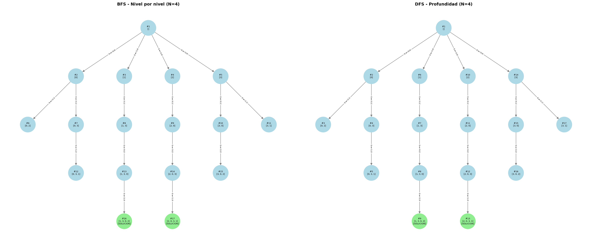
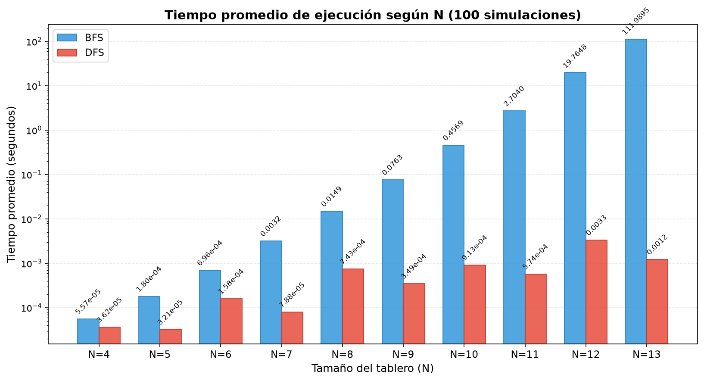
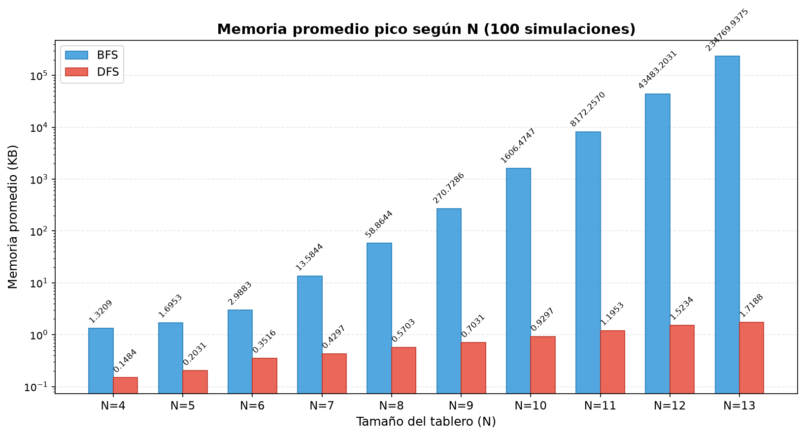
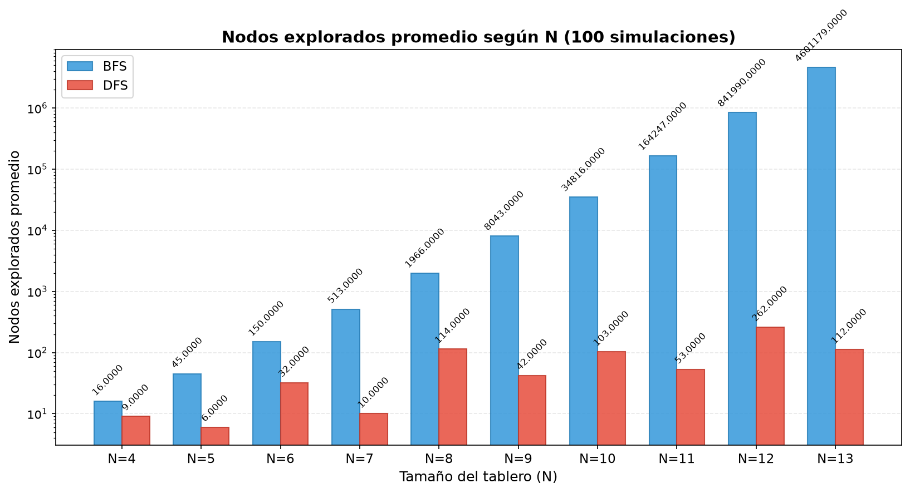
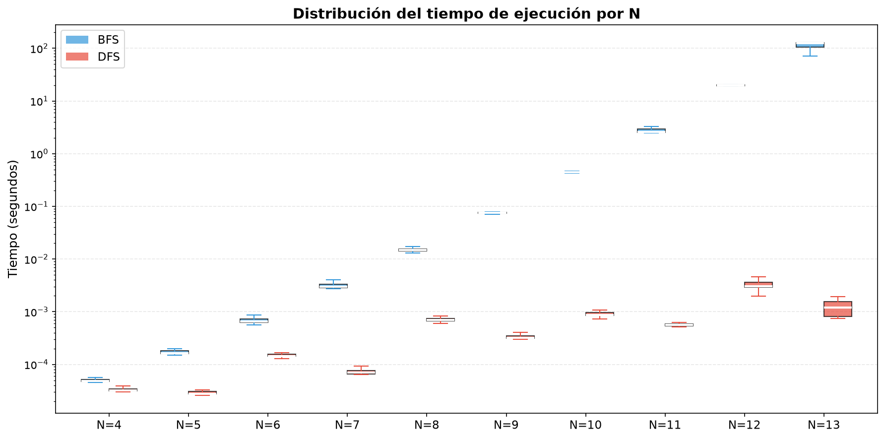
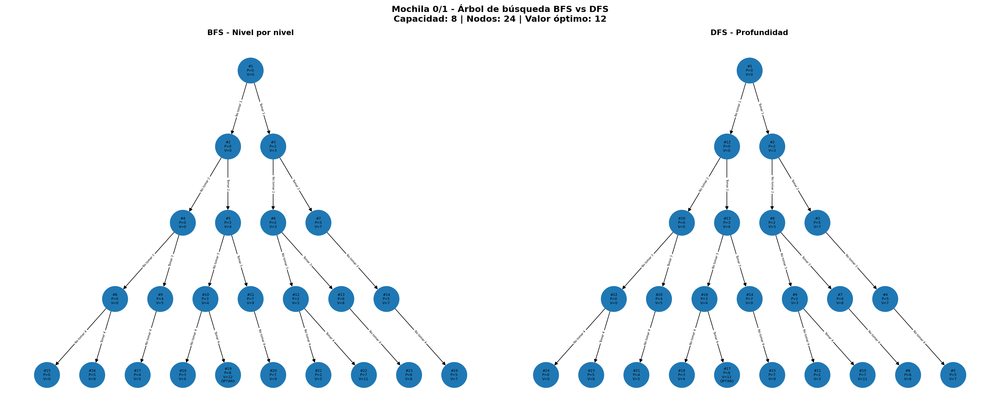
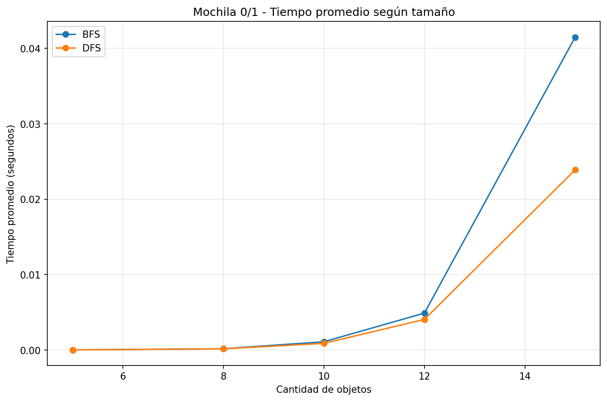
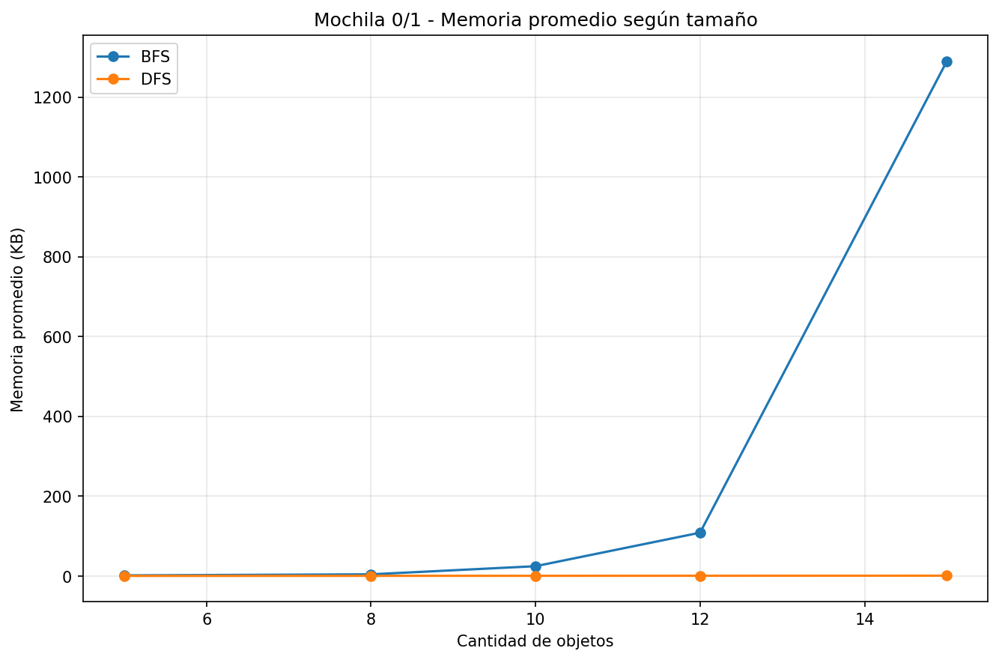
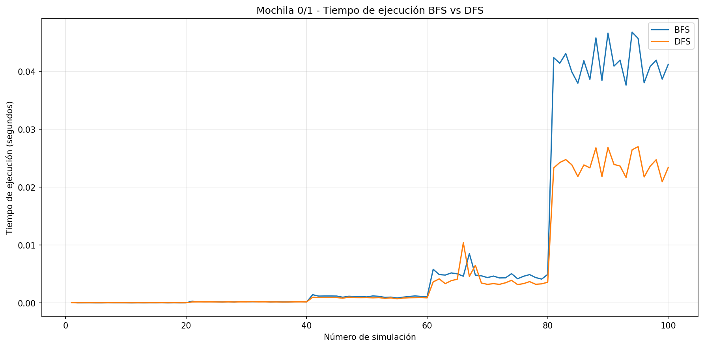
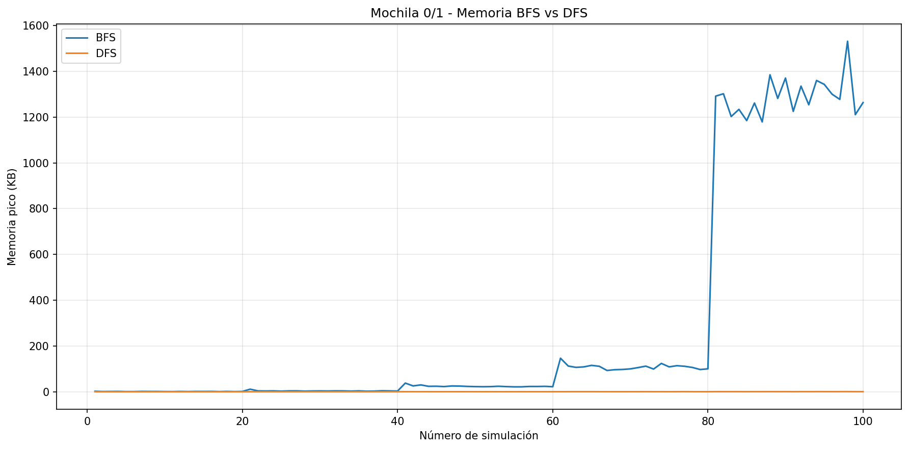

# Informe Final
## Análisis de Desempeño de BFS vs DFS en Problemas Combinatorios

---

## 1. Introducción

La búsqueda en anchura (**BFS**) y la búsqueda en profundidad (**DFS**) son estrategias clásicas para recorrer espacios de estados. Aunque ambas permiten explorar soluciones en problemas combinatorios, su comportamiento puede cambiar de manera importante según la estructura del problema, la profundidad de las soluciones y la cantidad de estados que deben mantenerse en memoria.

En este proyecto se compara experimentalmente el desempeño de BFS y DFS en tres problemas:

- Puzzle 3x3.
- N-Reinas.
- Mochila 0/1.

En la versión actual de este informe se consolidan los resultados correspondientes a **N-Reinas** y **Mochila 0/1**. La sección de Puzzle 3x3 se incorporará posteriormente con la misma metodología de análisis.

---

## 2. Objetivos

### 2.1 Objetivo general

Comparar experimentalmente el desempeño de BFS y DFS en distintos problemas combinatorios, evaluando principalmente el tiempo de ejecución y el consumo de memoria.

### 2.2 Objetivos específicos

- Implementar BFS y DFS en problemas con estructuras de espacio de estados diferentes.
- Medir tiempo de ejecución, memoria pico y nodos explorados.
- Analizar el comportamiento de ambos algoritmos mediante tablas, gráficas y árboles de búsqueda.
- Relacionar los resultados experimentales con la estructura particular de cada problema.
- Determinar en qué condiciones una estrategia resulta más conveniente que la otra.

---

## 3. Metodología General

Las implementaciones fueron desarrolladas en Python. Para la medición experimental se utilizaron principalmente:

- `time.perf_counter()` para medir tiempo de ejecución.
- `tracemalloc` para registrar memoria pico durante la ejecución.
- Contadores explícitos de nodos explorados como métrica auxiliar.

Dentro de cada problema, BFS y DFS se ejecutan bajo las mismas condiciones de entrada, de modo que la comparación entre ambos sea directa.

La complejidad teórica se interpreta de acuerdo con la estructura de cada espacio de búsqueda. Por esta razón, N-Reinas y Mochila 0/1 no presentan la misma expresión asintótica aunque utilicen los mismos algoritmos de recorrido.

---

## 4. Análisis del Problema de N-Reinas

### 4.1 Descripción del problema

El problema de N-Reinas consiste en ubicar N reinas sobre un tablero de tamaño N × N de manera que ninguna pueda atacar a otra. Esto implica evitar coincidencias en filas, columnas y diagonales.

En la implementación utilizada, el tablero se representa como una lista en la que el índice corresponde a la columna y el valor almacenado corresponde a la fila en la que se ubica la reina.

El objetivo de BFS y DFS es encontrar la primera solución completa válida.

### 4.2 Configuración experimental

Se evaluaron tamaños entre N=4 y N=13. La cantidad de repeticiones disminuye en los valores más grandes debido al aumento significativo del costo de BFS.

| N | Repeticiones por algoritmo |
|---:|---:|
| 4 a 10 | 100 |
| 11 | 50 |
| 12 | 20 |
| 13 | 10 |

Las métricas principales fueron tiempo de ejecución y memoria pico, mientras que los nodos explorados se utilizaron como apoyo para interpretar las diferencias observadas.

### 4.3 Complejidad

El espacio de búsqueda de N-Reinas tiene un comportamiento combinatorio asociado a las diferentes posiciones posibles de las reinas. En el peor caso, el crecimiento se aproxima a una estructura factorial.

| Aspecto | BFS | DFS |
|---------|-----|-----|
| **Tiempo peor caso** | O(N!) | O(N!) |
| **Espacio de frontera** | O(N!) | O(N) |
| **Orden de recorrido** | Nivel por nivel | Rama por rama |
| **Criterio de terminación** | Primera solución completa | Primera solución completa |

DFS resulta espacialmente favorable porque profundiza una rama y mantiene principalmente el camino actual y las alternativas pendientes. BFS, en cambio, puede conservar simultáneamente una gran cantidad de estados pertenecientes al mismo nivel.

### 4.4 Árbol de búsqueda

Para visualizar el comportamiento de ambos algoritmos se utiliza N=4.



El árbol permite observar que BFS recorre los estados por niveles, mientras DFS avanza en profundidad hasta encontrar una solución o necesitar retroceder.

Esta diferencia de orden es relevante porque en N-Reinas no se requiere encontrar una solución con profundidad mínima: todas las soluciones completas tienen N reinas. Por tanto, recorrer niveles completos antes de profundizar no aporta una ventaja práctica para este criterio de terminación.

### 4.5 Tiempo de ejecución



Los resultados muestran una diferencia creciente entre BFS y DFS a medida que aumenta N. Para tamaños pequeños ambos algoritmos pueden completar la búsqueda rápidamente, pero BFS incrementa su costo de forma mucho más marcada en las instancias grandes.

Para N=13, los resultados guardados muestran un tiempo promedio aproximado de **112 segundos para BFS**, mientras DFS se mantiene alrededor de **0,0012 segundos**.

Este comportamiento se explica por la forma en que BFS debe expandir y conservar grandes niveles del espacio de búsqueda antes de llegar a estados completos, mientras DFS puede alcanzar rápidamente una solución profundizando por una secuencia válida de decisiones.

### 4.6 Consumo de memoria



La diferencia de memoria es todavía más marcada. BFS conserva una frontera amplia y el número de estados almacenados crece rápidamente con N.

Para N=13, BFS alcanza aproximadamente **234.770 KB**, mientras DFS utiliza alrededor de **1,7 KB** en los resultados registrados.

Esto confirma que la principal desventaja práctica de BFS en N-Reinas es el tamaño de la frontera que debe mantener simultáneamente.

### 4.7 Nodos explorados



La cantidad de nodos explorados muestra que BFS debe procesar una fracción mucho mayor del espacio de búsqueda antes de alcanzar una solución completa.

DFS, al profundizar en una rama válida, puede encontrar la primera solución con una cantidad considerablemente menor de estados procesados.

Por tanto, en este problema la diferencia de tiempo y memoria no se debe únicamente a las estructuras de datos utilizadas, sino también a que el criterio de terminación favorece el orden de recorrido de DFS.

### 4.8 Distribución del tiempo



La distribución temporal permite observar la variabilidad de las mediciones. En los valores mayores de N, BFS presenta ejecuciones mucho más costosas y una dispersión mayor que DFS.

DFS se mantiene relativamente estable debido a que, bajo el orden de generación utilizado, suele alcanzar una primera solución completa después de explorar una cantidad reducida de estados.

### 4.9 Conclusión particular de N-Reinas

Los resultados experimentales muestran que **DFS es considerablemente más eficiente que BFS para encontrar la primera solución del problema de N-Reinas** en esta implementación.

La ventaja de DFS se manifiesta en las tres métricas analizadas: explora menos nodos, requiere menos tiempo y utiliza mucha menos memoria. BFS no obtiene un beneficio práctico por recorrer el espacio nivel por nivel, ya que el problema no exige encontrar una solución de menor profundidad.

---

## 5. Análisis del Problema de Mochila 0/1

### 5.1 Descripción del problema

El problema de Mochila 0/1 consiste en seleccionar un subconjunto de objetos con el propósito de maximizar su valor total sin superar una capacidad máxima de peso.

Cada objeto tiene dos posibilidades:

- No tomarlo.
- Tomarlo, siempre que el peso acumulado no supere la capacidad.

El estado utilizado en la implementación es:

```text
(indice, peso_actual, valor_actual, seleccionados)
```

Cada nivel del árbol representa la decisión asociada a un objeto.

### 5.2 Configuración experimental

Se realizaron 100 instancias aleatorias distribuidas en cinco tamaños:

| Cantidad de objetos | Simulaciones |
|---:|---:|
| 5 | 20 |
| 8 | 20 |
| 10 | 20 |
| 12 | 20 |
| 15 | 20 |

Para cada instancia:

- Los pesos se generan entre 1 y 15.
- Los valores se generan entre 1 y 30.
- La capacidad corresponde aproximadamente al 40 % del peso total.
- Se utiliza `random.seed(42)` para reproducibilidad.
- La misma instancia se ejecuta con BFS y DFS.

En total se realizan 200 ejecuciones: 100 con BFS y 100 con DFS.

### 5.3 Complejidad

En Mochila 0/1, cada objeto puede generar hasta dos decisiones, por lo que el árbol puede crecer exponencialmente.

| Aspecto | BFS | DFS |
|---------|-----|-----|
| **Tiempo peor caso** | O(2^N) | O(2^N) |
| **Espacio de frontera** | O(2^N) | O(N) |
| **Profundidad máxima** | O(N) | O(N) |
| **Orden de recorrido** | Nivel por nivel | Rama por rama |

Ambos algoritmos realizan una búsqueda exhaustiva sobre el mismo árbol factible y, por tanto, presentan la misma complejidad temporal asintótica en el peor caso.

La principal diferencia aparece en el espacio utilizado por la frontera. Estas expresiones consideran cada estado como una unidad. En la implementación concreta, cada estado almacena además la lista de objetos seleccionados, por lo que el consumo real de memoria incluye el costo adicional de almacenar y copiar dicha lista.

### 5.4 Árbol de búsqueda

Para la visualización se utiliza una instancia pequeña con:

- Pesos: `[2, 3, 4, 5]`.
- Valores: `[3, 4, 5, 8]`.
- Capacidad: `8`.

La solución óptima tiene valor **12** y ambos algoritmos exploran **24 nodos**.



La figura presenta el mismo árbol de decisiones para BFS y DFS, pero con diferente orden de visita. Esto es importante porque permite comprobar que la diferencia de desempeño no proviene de que un algoritmo explore menos estados en esta implementación.

### 5.5 Resultados cuantitativos

| Objetos | BFS Tiempo | DFS Tiempo | BFS Memoria | DFS Memoria | Nodos BFS | Nodos DFS |
|--------:|-----------:|-----------:|------------:|------------:|----------:|----------:|
| 5 | 0.00002971 s | 0.00002710 s | 1.3758 KB | 0.1141 KB | 33.30 | 33.30 |
| 8 | 0.00017801 s | 0.00016852 s | 4.0250 KB | 0.2367 KB | 214.25 | 214.25 |
| 10 | 0.00110635 s | 0.00089131 s | 24.3918 KB | 0.3352 KB | 827.70 | 827.70 |
| 12 | 0.00490357 s | 0.00406395 s | 108.3906 KB | 0.4445 KB | 3071.30 | 3071.30 |
| 15 | 0.04147082 s | 0.02388505 s | 1289.9215 KB | 0.6406 KB | 22012.05 | 22012.05 |

Los datos muestran que BFS y DFS exploran exactamente la misma cantidad promedio de nodos para cada tamaño.

Por tanto, las diferencias de tiempo y memoria observadas se relacionan principalmente con la forma en que cada estrategia administra la frontera de búsqueda.

### 5.6 Tiempo de ejecución



En los tamaños pequeños la diferencia temporal entre BFS y DFS es reducida. Esto es esperable porque las ejecuciones duran fracciones muy pequeñas de segundo y el costo fijo de las operaciones puede influir en las mediciones.

A medida que aumenta la cantidad de objetos, la separación se vuelve más clara. Con 15 objetos, BFS tarda aproximadamente **0,04147 s**, mientras DFS tarda aproximadamente **0,02389 s**, lo que representa cerca de **73,63 % más tiempo para BFS**.

Como ambos algoritmos procesan los mismos estados, la diferencia se asocia principalmente al manejo de sus estructuras de frontera.

### 5.7 Consumo de memoria



La memoria constituye la diferencia más importante en Mochila 0/1.

BFS utiliza una cola FIFO y conserva numerosos estados de un mismo nivel antes de avanzar. Esto provoca que el tamaño de la frontera aumente rápidamente con el número de objetos.

DFS utiliza una pila LIFO y profundiza una rama antes de continuar con las demás alternativas. Por esta razón mantiene simultáneamente una cantidad mucho menor de estados pendientes.

Con 15 objetos, BFS utiliza aproximadamente **1289,92 KB**, mientras DFS utiliza aproximadamente **0,64 KB**. En términos relativos, BFS consume alrededor de **2014 veces** la memoria promedio de DFS.

### 5.8 Comportamiento a lo largo de las simulaciones



La evolución de los tiempos por simulación evidencia el incremento del costo computacional conforme se pasa a instancias con mayor cantidad de objetos.



La gráfica de memoria confirma que el crecimiento de BFS es mucho más pronunciado que el de DFS. La diferencia se hace especialmente visible en las instancias correspondientes a 12 y 15 objetos.

### 5.9 Conclusión particular de Mochila 0/1

En Mochila 0/1, BFS y DFS encuentran el mismo valor óptimo y exploran la misma cantidad de nodos porque ambos realizan una búsqueda exhaustiva sobre el mismo árbol factible.

Sin embargo, DFS presenta una ventaja clara en consumo de memoria y también un mejor desempeño temporal en las instancias más grandes.

La principal causa no es una reducción del espacio explorado, sino la forma en que cada algoritmo conserva los estados pendientes. BFS mantiene una frontera amplia, mientras DFS mantiene una frontera mucho más pequeña.

---

## 6. Comparación Parcial entre N-Reinas y Mochila 0/1

Los resultados obtenidos hasta el momento permiten observar que DFS resulta más conveniente en ambos problemas, pero **por razones diferentes**.

En N-Reinas, DFS no solo utiliza menos memoria: también explora considerablemente menos nodos antes de encontrar la primera solución. El criterio de terminación favorece la exploración en profundidad, ya que no es necesario recorrer todos los estados de niveles anteriores para obtener una solución completa.

En Mochila 0/1, en cambio, BFS y DFS recorren el mismo número de estados. La ventaja de DFS proviene principalmente del manejo de la frontera, ya que no necesita conservar simultáneamente un nivel completo del árbol.

| Característica | N-Reinas | Mochila 0/1 |
|----------------|-----------|-------------|
| Crecimiento teórico principal | Factorial O(N!) | Exponencial O(2^N) |
| BFS explora más nodos que DFS | Sí, en los resultados observados | No |
| DFS tiene ventaja en memoria | Sí | Sí |
| DFS tiene ventaja en tiempo | Sí, muy marcada | Sí, principalmente en tamaños grandes |
| Razón principal de la ventaja | Encuentra una solución profunda rápidamente | Mantiene una frontera mucho menor |

Esta comparación muestra que una misma diferencia experimental puede tener causas distintas dependiendo de la estructura del problema.

---

## 7. Conclusiones Generales

Los resultados obtenidos en N-Reinas y Mochila 0/1 permiten concluir que el desempeño de BFS y DFS no puede evaluarse únicamente a partir de su definición teórica como recorridos en anchura o profundidad. La estructura del espacio de estados, el criterio de terminación y la representación de los nodos tienen un efecto directo sobre el tiempo y la memoria utilizados.

En **N-Reinas**, DFS presenta una ventaja muy marcada porque profundiza rápidamente hasta alcanzar una solución completa. BFS, al recorrer nivel por nivel, procesa y mantiene una gran cantidad de estados antes de llegar a la profundidad necesaria. Como consecuencia, DFS explora menos nodos y obtiene resultados considerablemente mejores tanto en tiempo como en memoria.

En **Mochila 0/1**, ambos algoritmos recorren el mismo árbol factible y exploran la misma cantidad de nodos. Esto permite observar con claridad el efecto exclusivo del orden de recorrido y del manejo de la frontera. BFS necesita conservar simultáneamente muchos estados de un mismo nivel, mientras DFS profundiza una rama y mantiene menos alternativas pendientes. Por esta razón, la diferencia más significativa aparece en el consumo de memoria.

Los resultados también muestran que las diferencias entre BFS y DFS se hacen más importantes a medida que aumenta el tamaño de las instancias. En problemas pequeños, ambas estrategias pueden presentar tiempos similares; sin embargo, cuando el espacio de búsqueda crece, la administración de la frontera y el orden de exploración se vuelven determinantes.

Desde el punto de vista teórico, los dos problemas presentan crecimientos distintos. N-Reinas se relaciona con un espacio de búsqueda de naturaleza factorial, mientras Mochila 0/1 presenta una estructura binaria con crecimiento exponencial. Esta diferencia confirma que la complejidad no depende únicamente del algoritmo BFS o DFS, sino también del problema sobre el cual se aplica.

Por tanto, no es correcto afirmar de manera general que BFS o DFS sea siempre superior. **La estrategia más conveniente depende de las características del problema y del objetivo de la búsqueda.** En los dos casos analizados hasta el momento, DFS resultó más favorable, aunque las razones fueron diferentes: en N-Reinas porque alcanza una primera solución recorriendo una fracción mucho menor del espacio, y en Mochila porque administra de forma mucho más eficiente la memoria aun cuando explora los mismos estados que BFS.

La incorporación posterior de Puzzle 3x3 permitirá completar la comparación global y verificar cómo cambia este comportamiento en un problema donde la profundidad de la solución y la garantía de camino mínimo de BFS tienen un papel más importante.

---

## 8. Trabajo Pendiente

La versión final del informe incorporará el análisis de **Puzzle 3x3**, incluyendo:

- configuración experimental,
- resultados globales,
- ejecuciones que alcanzaron el límite experimental,
- comparación de ejecuciones completadas,
- árbol parcial de búsqueda,
- gráficas de tiempo, memoria y nodos,
- conclusión particular del problema.

Después de incorporar Puzzle 3x3, se actualizará la sección de conclusiones generales para integrar los resultados de los tres problemas.
